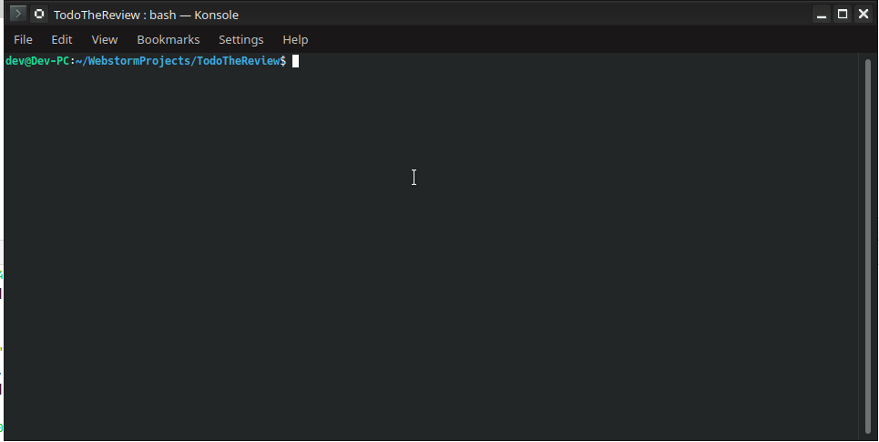

# review-todos

####[ Work in progrss ]

A node.js CLI tool utility made for be a  part of a review process tool-chain

Last Progress ( FolderPaths, files and their weights metrics extraction)



##Overview
The problem is the we have in hereditance usually a codebase where <br>we need to check if 
all of it is compliant with the best practicies and compliance rules that <br> 
we assign to ourselfs as perfectionists.<br><br>
So i thinked, <br> 
what if a CLI tool can guide me in that repetitive task?<br><br>
so that are some concept that are still self-organizing in a structure in my mind:
- Inside every folder there going to be a review chunk for an amount of a metrics ( tot-chars / nfiles);
- Initially I may do that by #TODO of Intellij IDEs and Github Actions for Issue creation 
- After i can implement myself a good Console Interface for Guide me through the process of 
    - Write inside ReviewChunks files some Rules Compliance Assessment Statements 
    - Append to files Standardized TODOs or write custom ones by CLI 
    - Reactivate Time by Time Review Task through a settable maintenance scheduling strategy.
##Roadmap

- [x]   Getting the targets folders for folder-name_ChunkN.review files.
- [x]   Find and stick to files indicative data (chars x file) about effort weights
- [ ]   Assest needed techinical diagrams and draw them  
- [ ]   Iterate over targets, create N folder-name_ChunkN.review files based on char limits x chunk 
- [ ]   Add a "review.conf" file life-cycle handling, and parametrize given the settings
- [ ]   Find a way to know fast if new files are added/edited (by hash? by .git data?)
- [ ]   Update chunks given codebase changes 
- [ ]   Implement rulesets 
- [ ]   Implement a friendly CLI user interface 
## Requirements

- node.js v10.19.0>
- npm

## Setup 
````
npm install
````

## Run 

````
npm start
````

